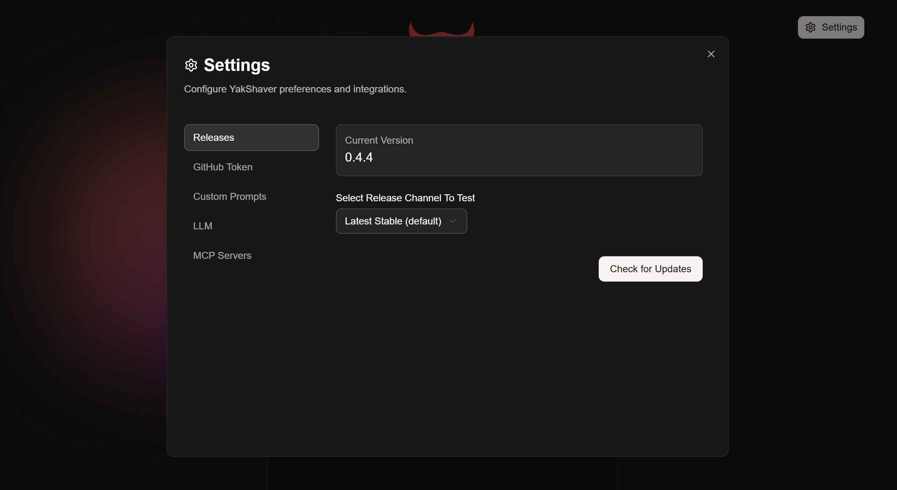
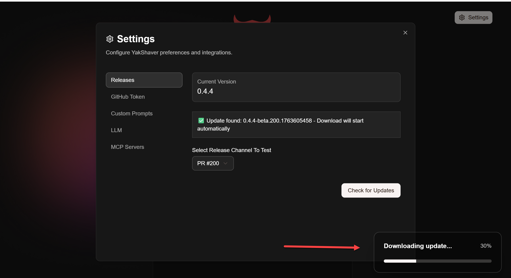
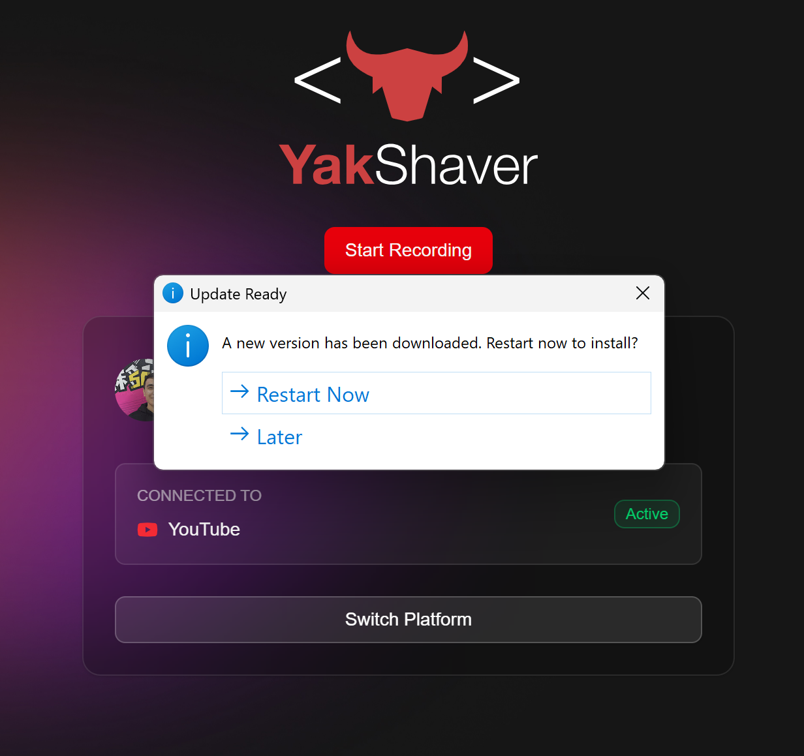

# Release Settings & PR Pre-releases

This document explains how to use the Releases settings in the SSW YakShaver Desktop app, including how to test PR pre-releases and switch between stable and PR builds.

---

## 1. Accessing Release Settings

- Open the app and click the **Settings** button (top right corner).
- Go to the **Releases** tab.

---

## 2. Understanding Release Channels

- **Latest Stable**: The default channel. You will receive only official, production releases.
- **PR Pre-release**: Select a specific PR (Pull Request) to test its pre-release build. This is useful for QA, UAT, or reviewing new features before they are merged.

---

## 3. Selecting a PR Pre-release

- Open the dropdown under **Select Release Channel To Test**.
- You will see a list of available PRs, each showing:
  - PR number (e.g., PR #123)
  - Version (e.g., 0.3.8-beta.123.1700000000)
  - Published date/time
- Select the PR you want to test.

---

## 4. Checking for Updates

- After selecting a channel, click **Check for Updates**.
- If a new version is available, the app will start downloading it automatically.
- You will see a download progress bar in the bottom-right corner.

- When the update is ready, you will be prompted to restart the app to install it.

---

## 5. Switching Back to Stable

- To return to the official release track, select **Latest Stable (default)** in the dropdown and check for updates again.

---

## 6. Notes

- **GitHub Token**: You may need to configure a GitHub token to access PR pre-releases. See the **GitHub Token** tab in settings.
- **Auto-update**: The app checks for updates every 10 minutes in the background.
- **PR Cleanup**: When a PR is closed, its pre-release is automatically deleted.

---

## 7. Troubleshooting

- If you do not see your PR in the list, ensure the PR build has completed and published a pre-release.
- If you see errors about rate limits, add a GitHub token in settings.

---
